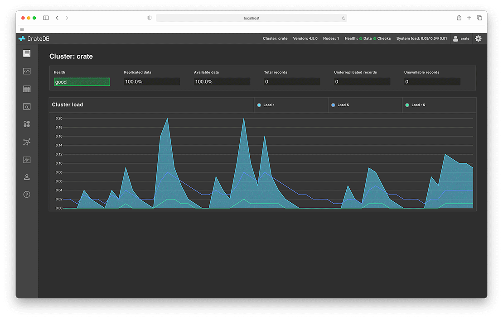

----

.. image:: https://github.com/crate/crate/workflows/CrateDB%20SQL/badge.svg?branch=master
    :target: https://github.com/crate/crate/actions?query=workflow%3A%22CrateDB+SQL%22

.. image:: https://img.shields.io/badge/docs-latest-brightgreen.svg
    :target: https://cratedb.com/docs/crate/reference/en/latest/

.. image:: https://img.shields.io/badge/container-docker-green.svg
    :target: https://hub.docker.com/_/crate/

|

`Help us improve CrateDB by taking our User Survey! <https://cratedb.com/user-survey>`_

About
=====

CrateDB is a distributed SQL database that makes it simple to store and analyze
massive amounts of data in real-time.

CrateDB offers the `benefits`_ of an SQL database *and* the scalability and
flexibility typically associated with NoSQL databases. Modest CrateDB clusters
can ingest tens of thousands of records per second without breaking a
sweat. You can run ad-hoc queries using `standard SQL`_. CrateDB's blazing-fast
distributed query execution engine parallelizes query workloads across the
whole cluster.

CrateDB is well suited to `containerization`_, can be `scaled horizontally`_
using ephemeral virtual machines (e.g., `Kubernetes`_, `AWS`_, and `Azure`_)
with `no shared state`_. You can deploy and run CrateDB on any sort of network
— from personal computers to `multi-region hybrid clouds and the edge`_.

Features
========

- Use `standard SQL`_ via the `PostgreSQL wire protocol`_ or an `HTTP API`_.

- Dynamic table schemas and queryable objects provide
  document-oriented features in addition to the relational features of SQL.

- Support for time-series data, real-time full-text search, geospatial data
  types and search capabilities.

- Horizontally scalable, highly available and fault-tolerant clusters that run
  very well in virtualized and containerized environments.

- Extremely fast distributed query execution.

- Auto-partitioning, auto-sharding, and auto-replication.

- Self-healing and auto-rebalancing.

- `User-defined functions`_ (UDFs) can be used to extend the functionality of CrateDB.

Screenshots
===========

CrateDB provides an `Admin UI`_:

Try CrateDB
===========

The fastest way to try CrateDB out is by running:

.. code-block:: console

    sh$ bash -c "$(curl -L try.crate.io)"

Or spin up the official `Docker image`_:

.. code-block:: console

    sh$ docker run --publish 4200:4200 --publish 5432:5432 --env CRATE_HEAP_SIZE=1g crate -Cdiscovery.type=single-node

Visit the `installation documentation`_ to see all the available download and
install options.

Once you're up and running, head over to the `introductory docs`_. To interact
with CrateDB, you can use the Admin UI `sql console`_ or the `CrateDB shell`_
CLI tool. Alternatively, review the list of recommended `clients and tools`_
that work with CrateDB.

For container-specific documentation, check out the `CrateDB on Docker how-to
guide`_ or the `CrateDB on Kubernetes how-to guide`_.

Contributing
============

This project is primarily maintained by `Crate.io`_, but we welcome community
contributions!

See the `developer docs`_ and the `contribution docs`_ for more information.

Security
========

The CrateDB team and community take security bugs seriously. We appreciate your
efforts to `responsibly disclose`_ your findings, and will make every effort to
acknowledge your contributions.

If you think you discovered a security flaw, please follow the guidelines at
`SECURITY.md`_.

Help
====

Looking for more help?

- Try one of our `beginner tutorials`_, `how-to guides`_, or consult the
  `reference manual`_.

- Check out our `support channels`_.

- `Crate.io`_ also offers `CrateDB Cloud`_, a fully-managed *CrateDB Database
  as a Service* (DBaaS). The `CrateDB Cloud Tutorials`_ will get you started.

.. _Admin UI: https://cratedb.com/docs/crate/admin-ui/
.. _AWS: https://cratedb.com/docs/crate/tutorials/en/latest/cloud/aws/index.html
.. _Azure: https://cratedb.com/docs/crate/tutorials/en/latest/cloud/azure/index.html
.. _beginner tutorials: https://cratedb.com/docs/crate/tutorials/
.. _benefits: https://cratedb.com/product#compare
.. _clients and tools: https://cratedb.com/docs/crate/clients-tools/
.. _containerization: https://cratedb.com/docs/crate/tutorials/en/latest/containers/docker.html
.. _contribution docs: CONTRIBUTING.rst
.. _Crate.io: https://cratedb.com/company/team
.. _CrateDB clients and tools: https://cratedb.com/docs/crate/clients-tools/
.. _CrateDB Cloud Tutorials: https://cratedb.com/docs/cloud/
.. _CrateDB Cloud: https://cratedb.com/product/pricing
.. _CrateDB on Docker how-to guide: https://cratedb.com/docs/crate/tutorials/en/latest/containers/docker.html
.. _CrateDB on Kubernetes how-to guide: https://cratedb.com/docs/crate/tutorials/en/latest/containers/kubernetes/index.html
.. _CrateDB shell: https://cratedb.com/docs/crate/crash/
.. _developer docs: devs/docs/index.rst
.. _Docker image: https://hub.docker.com/_/crate/
.. _document-oriented: https://en.wikipedia.org/wiki/Document-oriented_database
.. _Dynamic table schemas: https://cratedb.com/docs/crate/reference/en/master/general/ddl/column-policy.html
.. _fulltext search: https://cratedb.com/docs/crate/reference/en/latest/general/dql/fulltext.html
.. _geospatial features: https://cratedb.com/docs/crate/reference/en/master/general/dql/geo.html
.. _how-to guides: https://cratedb.com/docs/crate/howtos/
.. _HTTP API: https://cratedb.com/docs/crate/reference/en/latest/interfaces/http.html
.. _installation documentation: https://cratedb.com/docs/crate/tutorials/en/latest/basic/index.html
.. _introductory docs: https://cratedb.com/docs/crate/tutorials/
.. _Kubernetes: https://cratedb.com/docs/crate/tutorials/en/latest/containers/kubernetes/index.html
.. _multi-region hybrid clouds and the edge: https://cratedb.com/docs/cloud/en/latest/tutorials/edge/index.html
.. _no shared state: https://en.wikipedia.org/wiki/Shared-nothing_architecture
.. _PostgreSQL wire protocol: https://cratedb.com/docs/crate/reference/en/latest/interfaces/postgres.html
.. _queryable objects: https://cratedb.com/docs/crate/reference/en/master/general/dql/selects.html#container-data-types
.. _reference manual: https://cratedb.com/docs/crate/reference/
.. _relational: https://en.wikipedia.org/wiki/Relational_model
.. _responsibly disclose: https://en.wikipedia.org/wiki/Coordinated_vulnerability_disclosure
.. _scaled horizontally: https://stackoverflow.com/questions/11707879/difference-between-scaling-horizontally-and-vertically-for-databases
.. _SECURITY.md: https://github.com/crate/crate/blob/master/SECURITY.md
.. _sql console: https://cratedb.com/docs/crate/admin-ui/en/latest/console.html#sql-console
.. _standard SQL: https://cratedb.com/docs/crate/reference/en/latest/sql/index.html
.. _support channels: https://cratedb.com/support
.. _time-series data: https://cratedb.com/docs/crate/howtos/en/latest/getting-started/normalize-intervals.html
.. _user-defined functions: https://cratedb.com/docs/crate/reference/en/latest/general/user-defined-functions.html
