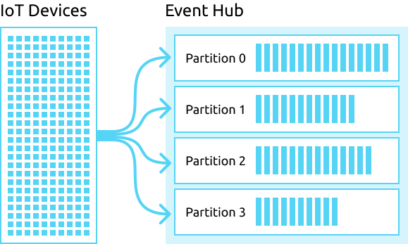
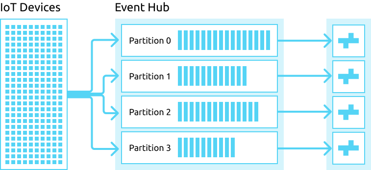
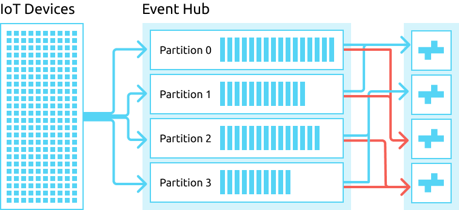

.. highlight:: psql
.. _ingest_event_hub:

================================
Azure Event Hub Ingestion Source
================================

.. sidebar:: Overview

   .. figure:: event-hub-03.png
      :alt: A diagram of CrateDB cluster acting a consumer of an Azure Event Hub.

`Azure Event Hub`_ is a telemetry ingestion service that can collect and store
millions of events, from services such as the `Azure IoT Hub`_.

The Azure Event Hub ingestion source allows CrateDB to function as a consumer
of events that are published to a hub, ingesting the data into user defined
tables. These ingestion pipeline can be defined according to
:ref:`user defined ingestion rules <administration-ingestion-rules>`. Once
ingested, this data can be queried, aggregated and transformed by a CrateDB
client.

Using CrateDB as an Azure Event Hub consumer allows you to consume IoT events
in real time as they are published, without the need for an intermediary
process to collect and forward the data.

.. NOTE::

   The Azure Event Hub ingestion source is an
   :ref:`enterprise feature <enterprise_features>`.

.. rubric:: Table of Contents

.. contents::
   :local:

.. _ingest_event_hub_config:

Configuration
=============

This ingestion source adds a few additional settings that you can configure.

These node settings can be :ref:`configured like usual <config>`, via the
``crate.yml`` configuration file or as command line parameters using the ``-C``
option.

Node Settings
-------------

.. NOTE::

   Node settings only affect the node they are configured on.

**ingestion.event_hub.enabled**
  | *Default:*   ``false``
  | *Runtime:*  ``no``

  Enables the `Azure Event Hub`_ ingestion source on this node.

**ingestion.event_hub.connectionString**
  | *Runtime:*  ``no``

  The connection string of the Event Hub to recieve from.

**ingestion.event_hub.storageConnectionString**
  | *Runtime:*  ``no``

  The connection string for the Azure Storage account to use for persisting
  leases and checkpoints.

**ingestion.event_hub.storageContainerName**
  | *Runtime:*  ``no``

  The Azure Storage container name for use by the reciever's lease and checkpoint
  manager.

**ingestion.event_hub.eventHubName**
  | *Runtime:*  ``no``

  The name of the `Azure Event Hub`_ to recieve events from.

**ingestion.event_hub.consumerGroupName**
  | *Default:*   ``$Default``
  | *Runtime:*  ``no``

  The name of the consumer group to use when recieving from the `Azure Event Hub`_.

Usage
=====

Distributed Event Consumption
-----------------------------

Event hubs split their streams into subsets, called partitions, defined at
the creation of the Event Hub. This partitioning scheme allows for horizontal
scaling of event stream consumption that would be difficult to implement on
a single queue.

This partioning allows several CrateDB nodes within a cluster to consume
streams from the Event Hub in parallel. For example, a 2 node cluster consuming
the streams from a 4 partition Event Hub will give each node 2 partitions to
consume in parallel.

When new CrateDB nodes are added or removed from the cluster, the ingestion
will then redistribute the partition consumption across the nodes in a way to
maximise parallel consumption.

Distributed event data ingestion is managed primarily through the use of the
consumer group. A consumer group is an entity on an Event Hub that provides a
shared context or view of the event stream, so that multiple consumers can consume
the same event stream in parallel. Every node consuming the stream from the Event
Hub should use the same consumer group, as this will allow the nodes to
automatically coordinate and distribute their consumption.

However, it is also possible to give different nodes different consumer groups.
In the following example, 2 nodes are given 1 consumption group and the other 2
nodes are given another. The Event Hub ingestion will then distribute the
partition consumption across the nodes in that specific consumer group, and the
ultimate effect will be that the event stream will be consumed twice.

Data Ingestion
--------------

The ingestion of data is controlled with :ref:`administration-ingestion-rules`.

Without any defined valid rule, no data will be ingested and all events recieved
will be discarded.

The ``source_ident`` of this implementation is: ``event_hub``

Rule conditions and the target table must match the `Event Hub data structure`_.

The default user for the ``INSERT`` operations in the ``target_table`` is the
superuser ``crate``.

.. _ingest_event_hub_data_structure:

Event Hub Data Structure
........................

+--------------------+------------+-----------------------------------------------------+
| Name               | Type       | Description                                         |
+====================+============+=====================================================+
| partition_context  | OBJECT     | Information related to the partition the event was  |
|                    |            | recieved from.                                      |
+--------------------+------------+-----------------------------------------------------+
| event_metadata     | OBJECT     | Meta-information about the event that was recieved. |
+--------------------+------------+-----------------------------------------------------+
| ts                 | TIMESTAMP  | Insert timestamp (``CURRENT_TIMESTAMP``).           |
+--------------------+------------+-----------------------------------------------------+
| payload            | STRING     | ``payload`` of the event, cast as a UTF8 string.    |
+--------------------+------------+-----------------------------------------------------+

Example
.......

To begin Azure Event Hub ingestion, first create a target table matching the
`Event Hub data structure`_, like so::

    cr> CREATE TABLE event_hub_ingest (
    ...  "partition_context" OBJECT(DYNAMIC),
    ...  "event_metadata" OBJECT(DYNAMIC),
    ...  "ts" TIMESTAMP,
    ...  "payload" STRING,
    ... )
    CREATE OK, 1 row affected (... sec)

Once you have created this table, you can create :ref:`ingestion rules
<administration-ingestion-rules>`, like so::

    cr> CREATE INGEST RULE event_hub_ingest ON event_hub
    ...  INTO event_hub_ingest;
    CREATE OK, 1 row affected (... sec)

.. _Azure Event Hub: https://azure.microsoft.com/en-us/services/event-hubs/
.. _Azure IoT Hub: https://azure.microsoft.com/en-us/services/iot-hub/
