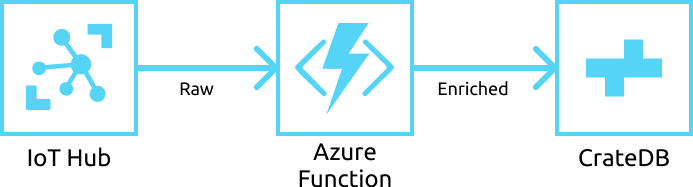

=====================================
Data Enrichment using Azure Functions
=====================================

This reference architecture document details how to create an enrichment
pipeline between data ingested into an Azure IoT Hub and CrateDB, using
serverless Azure Functions.

Abstract
========

Within IoT scale data solutions, ingestion of data from a multi-device source
like an Azure IoT Hub into a centralised source-of-truth database such as CrateDB
for data analysis is quite common. However, many use cases also call for the raw
data in the IoT Hub source to be transformed or enriched before final insertion
into CrateDB.

This can be acomplished using Azure Functions, event-driven code triggered by
new data flowing into a IoT Hub.

.. _figure_1:

An Azure Function is a short-lived, serverless computation that is triggered
by external events. The trigger produces an input payload, which is delivered
to the Azure Function. The Azure Function then does computation with this
payload, and then outputs its result to other Azure Functions, computation
services or storage services.

A common pattern is to use an Azure Function to enrich and ingest data
to a CrateDB instance, by connecting that Azure Function to an IoT Hub's new
messages trigger.

When new messages arrive in an IoT Hub, they will be batched and sent to the
Azure Function. This Azure Function can then perform enrichment computations
on the raw payload, and then ingest that payload into a CrateDB instance whichever
client corresponds to the language the Azure Function is written in.

Implementation
==============

Set Up
------

To illustrate how this architecture can be used, we shall create a scenario in which
we have a fleet of satellites, sending their location as a latitude and longitude
coordinate pair to an Azure IoT Hub. Each payload from each satellite looks like::

	{
	  "id": "Zero Gravitas",
	  "type": "unmanned",
	  "location": {
	    "longitude": -164.5984,
	    "latitude": -24.9734
	  },
	  "timestamp": 1588240576
	}

Each payload contains an ``id`` field with the satellite's name, the type of satellite,
the location of the satellite and the timestamp of when the location metric was taken.

The goal of this enrichment is two-fold. The first is to transform the ``location`` item
into a `WKT`_ string, such as ``POINT (-24.9734 -164.5984)`` before it is ingested. Secondly,
we wish to branch which **column** the payloads are ingested into depending on whether the
satellite is unmanned or manned.

Prerequisties
-------------

In order to deploy this architecture, there are several prerequesites. You should have:

- An IoT Hub with data flowing into it.
- A development environment for Azure Functions.
- An accessable CrateDB cluster.

/!\ Flesh out this section more! Add helpful links!

CrateDB
-------

Our CrateDB tables' structure will look like this:

.. code-block:: sql

	CREATE TABLE IF NOT EXISTS "doc"."satellites" (
	   "ts" TIMESTAMP WITHOUT TIME ZONE,
	   "ts_month" TIMESTAMP WITHOUT TIME ZONE GENERATED ALWAYS AS date_trunc('month', "ts"),
	   "unmanned" OBJECT(STRICT) AS (
	      "id" TEXT,
	      "location" GEO_POINT,
	      "timestamp" TIMESTAMP WITHOUT TIME ZONE
	   ),
	   "manned" OBJECT(STRICT) AS (
	      "id" TEXT,
	      "location" GEO_POINT,
	      "timestamp" TIMESTAMP WITHOUT TIME ZONE
	   ),
	   "debug" OBJECT(DYNAMIC)
	) CLUSTERED INTO 4 SHARDS
	  PARTITIONED BY ("ts_month");

Azure Function
--------------

We should first create an environment for our function application. Following the documentation
for whichever environment we would develop in (for example, `Visual Studio Code`_ ), we should have
a folder structure like this::

	ReferenceArchitectureProject
	 | - IoTHubToCrateDBFunction
	 | | - index.js
	 | | - function.json
	 | - node_modules
	 | - host.json
	 | - package.json
	 | - extensions.csproj
	 | - local.settings.json

Our azure function, ``IoTHubToCrateDBFunction``, will be composed of 2 files:

	- ``function.json`` which defines the metadata of our function.
	- ``index.js`` which is our core Azure Function.

Dependencies
............

Our Azure Function will rely on the `node-postgres`_ library to connect to CrateDB.
We can install this dependency by executing::

	$ npm install pg

within the ``ReferenceArchitectureProject`` folder. The dependency should now be in the ``node_modules`` folder,
which we will bundle with our azure function when we deploy the application.

``function.json``
.................

Our ``function.json`` is fairly straightforward, and just defines what events
we want to bind to, as well as things like eventhub names, consumer groups, etc.

.. code-block:: json

	{
	  "bindings": [{
	    "type": "eventHubTrigger",
	    "name": "eventHubMessages",
	    "direction": "in",
	    "eventHubName": "default",
	    "connection": "EventHubConnectionString",
	    "cardinality": "many",
	    "consumerGroup": "cratefunction"
	  }]
	}

The parameters here can benefit from some elucidation.

	- ``type`` signifies the type of binding we associate with this function. In this case, it is an
	  eventhub trigger.
	- ``name`` signifies the name that is used for the bound data in the Azure Function.
	- ``direction`` signifies whether the binding is for recieving data into the function, or sending the
	  data from the function. We have written ``in`` as the function is concerned with reading data in from
	  the eventhub.
	- ``eventHubName`` signifies the name of the event hub. The event hub name value in the connection string
	  overwrites this paramter at run time, if it is set.
	- ``connection`` signifies the name of the Azure Function application setting that contains our event hub's
	  namespace connection string.
	- ``cardinality`` signifies whether or not we want to use batching, or to consume messages one by one. Batching
	  is far more efficient for our use case, which is why it is set to ``many`` instead of ``one``.
	- ``consumerGroup`` signifies which consumer group will be used to consume messages from the eventhub. Ensure
	  that it is unique, and not already being used by another consumer. If omitted, it will use the default consumer
	  group of ``$Default``.

For more information, please consule the `Azure Event Hubs bindings for Azure Functions documentation`_.

local.settings.json
...................

To run this Azure Function application locallywe need to create a ``local.settings.json`` file
at the root of our Azure Functions Application project. It should have the following contents:

.. code-block:: json

	  {
	    "IsEncrypted": false,
	    "Values": {
	    	"AzureWebJobsStorage": "your web storage connection",
	      	"FUNCTIONS_WORKER_RUNTIME": "node",
	      	"EventHubConnectionString": "connection string to your eventhub",
	      	"CrateConnectionString": "connection string to CrateDB",
	      	"SinkTable": "doc.satellites",
	      	"SinkColumnUnmanned": "unmanned",
	      	"SinkColumnManned": "manned"
	    }
	  }

The ``AzureWebJobsStorage`` and ``EventHubConnectionString`` connection strings should be replaced with the relevant
ones, that you can find in the Azure Portal, ensuring that the event hub connection string includes the
``EntityPath=EVENTHUBNAME`` at the end of it.

The ``CrateConnectionString`` should be of the form postgres. MARK MARK

``SinkTable`` is the name of the table we will be ingesting data into, with the ``SinkColumnUnmanned`` and
``SinkColumnManned`` parameters defining what columns we will ingest unmanned and manned satellite data into,
respectively.

These settings **are not** deployed when we deploy the Azure Function. Instead, before we deploy, we should
set up an Azure Function Application within the Azure Portal. You can do this `directly from VSCode`_, or
using the `Azure CLI`_. These settings would then need be set up within the Azure Function's
**Application Settings**.

index.js
........

This file defines our Azure Function. Here it is in full, annotated so that you can go through it
step by step:

.. code-block:: javascript

	// Importing the pg library we will be using to connect to CrateDB
	const { Pool } = require('pg');

	// Importing settings from the Azure Function Application's settings
	const CRATE_CONNECTION_STRING = process.env['CrateConnectionString'];
	const SINK_TABLE = process.env['SinkTable'];
	const SINK_COLUMN_TIMESTAMPS = "ts";
	const SINK_COLUMN_UNMANNED = process.env['SinkColumnUnmanned'];
	const SINK_COLUMN_MANNED = process.env['SinkColumnManned'];
	const SINK_COLUMN_DEBUG = "debug";

	// A pool of connections to CrateDB that our Azure Function can utilise.
	// Notice that this instantiation takes place outside of our azure function itself.
	// This means we can use this pool across multiple azure function evocations.
	const cratePool = new Pool({
	    connectionString: CRATE_CONNECTION_STRING,
	    idleTimeoutMillis: 15000,
	    connectionTimeoutMillis: 5000,
	    query_timeout: 30000,
	});

	// This is the our Azure Function that will be called when new eventhub messages are processed.
	// It recieves the context, an object that provides us information and functions to do with the context
	// Of the invocation, as well as an array of eventhub messages.
	module.exports = async function (context, eventHubMessages) {

	    // Initialise empty arrays for storing rows
	    let timestamps = []
	    let manned = []
	    let unmanned = []
	    let debugs = []

	    // Iterate over the recieved eventhub messages
	    for (var i = 0; i < eventHubMessages.length; i++) {

	        // Extract the timestamp from the message
	        let timestamp = eventHubMessages[i]['timestamp'];
	        if (timestamp === undefined) {
	            context.log("Timestamp missing", error);
	            context.log(`'${JSON.stringify(eventHubMessages[i])}'`);
	            continue;
	        }

	        // Getting the enqueued time of the eventhub payload for debugging purposes
	        let debug = {
	            'enqueued_time': context.bindingData.enqueuedTimeUtcArray[i]
	        };

	        // Create a new payload object with the timestamp and JSONified debug object.
	        let payload = new Payload(timestamp, `'${JSON.stringify(debug)}'`);

	        // Extract the satellite type
	        let satelliteType = eventHubMessages[i]['type'];

	        // Ditch the type, now that we no longer need it in the payload.
	        eventHubMessages[i]['type'] = undefined

	        // Replace the location with a WKT string
	        let longitude = eventHubMessages[i]['location']['longitude']
	        let latitude = eventHubMessages[i]['location']['latitude']
	        eventHubMessages[i]['location'] = `POINT ( ${longitude} ${latitude})`

	        // Set the specific column depending on whether the type is manned or unmanned
	        if (satelliteType === undefined) {
	            context.log("Satellite type missing", error);
	            context.log(`'${JSON.stringify(context.bindingData.propertiesArray[i])}'`);
	            continue;
	        } else if (satelliteType === 'manned') {
	            timestamps.push(timestamps)
	            manned.push(`'${JSON.stringify(eventHubMessages[i])}'`)
	            unmanned.push("null")
	            debugs.push(`'${JSON.stringify(debug)}'`)
	        } else if (satelliteType === 'unmanned') {
	            timestamps.push(timestamps)
	            manned.push("null")
	            unmanned.push(`'${JSON.stringify(eventHubMessages[i])}'`)
	            debugs.push(`'${JSON.stringify(debug)}'`)
	        } else {
	            context.log("Incompatible satellite type", messageType);
	            context.log(`'${JSON.stringify(eventHubMessages[i])}'`);
	        }
	    };

	    // Construct SQL insertion statement
	    // We do it this way so we can bulk insert the whole payload of eventhub messages at once, rather than inserting row by row.
	    // However, the pg client does not support bulk inserts on the client side. Instead, we use UNNEST to do bulk insertion on the server side.
	    // See: https://crate.io/a/bulk-inserts-with-unnest/ for more information.
	    const stmt = `INSERT INTO ${SINK_TABLE} (${SINK_COLUMN_TIMESTAMPS}, ${SINK_COLUMN_UNMANNED}, ${SINK_COLUMN_MANNED}, ${SINK_COLUMN_DEBUG}) ` +
	        `(SELECT * FROM UNNEST (['${timestamps.join("','")}'], [${unmanned}], [${manned}], [${debugs}]));`

	    const crateClient = await cratePool.connect();
	    const queryPromise = crateClient.query(stmt)
	        .catch(err => {
	            context.log.error(err);
	            throw err;
	        })
	        .finally(() => crateClient.release());
	};

.. _WKT: https://en.wikipedia.org/wiki/Well-known_text
.. _Visual Studio Code: https://docs.microsoft.com/en-us/azure/azure-functions/functions-create-first-function-vs-code?pivots=programming-language-javascript
.. _directly from VSCode: https://scotch.io/tutorials/getting-started-with-azure-functions-using-vs-code-zero-to-deploy
.. _Azure CLI: https://docs.microsoft.com/en-us/azure/azure-functions/functions-create-first-azure-function-azure-cli
.. _node-postgres:  https://www.npmjs.com/package/pg
.. _Azure Event Hubs bindings for Azure Functions documentation: https://docs.microsoft.com/en-us/azure/azure-functions/functions-bindings-event-hubs-trigger?tabs=javascript