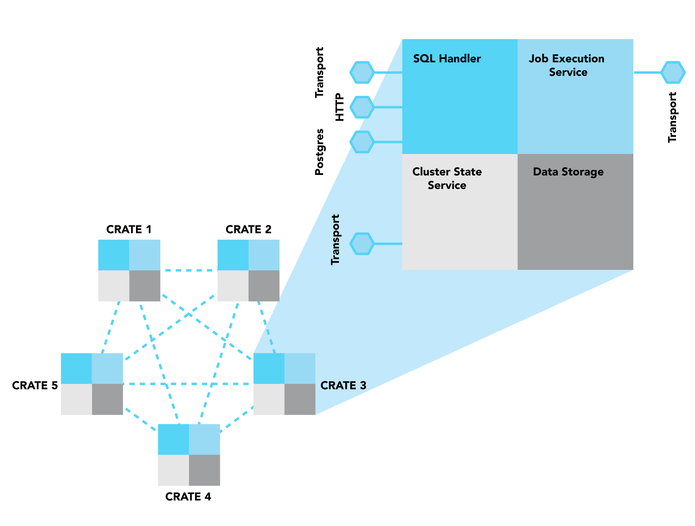
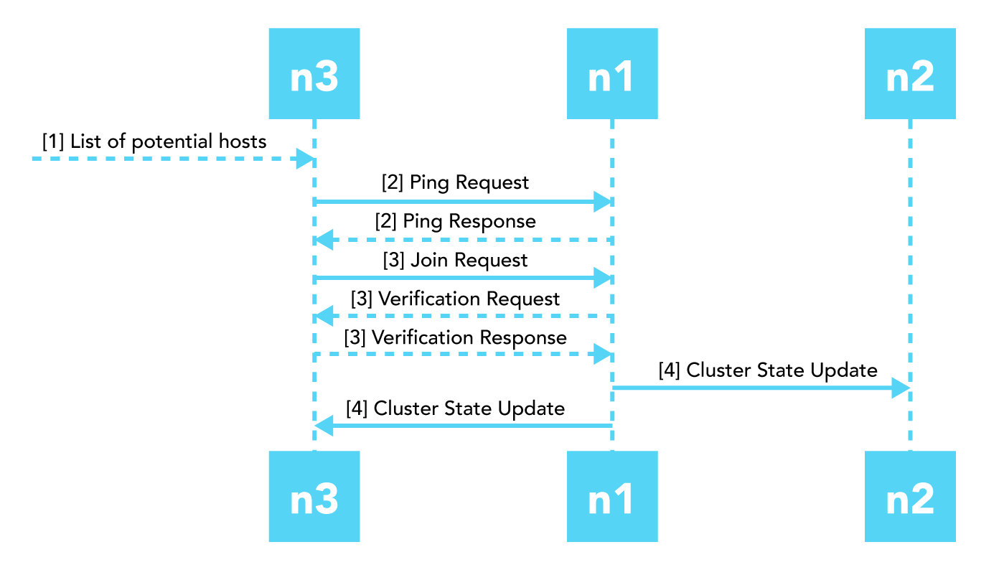
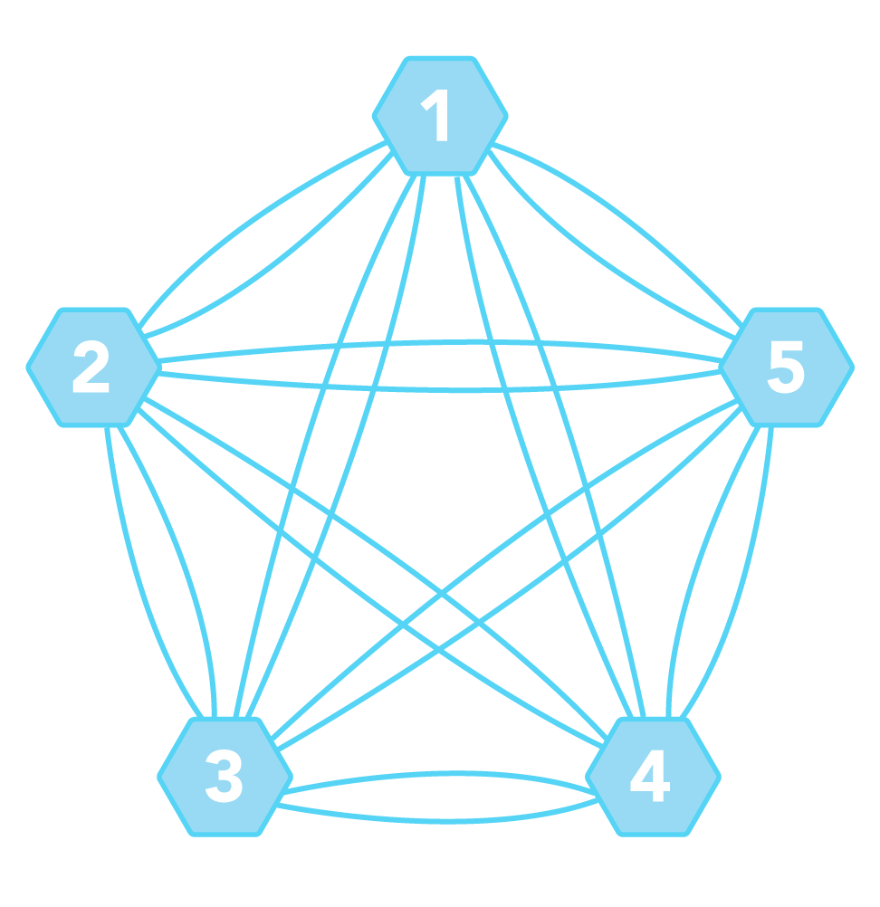
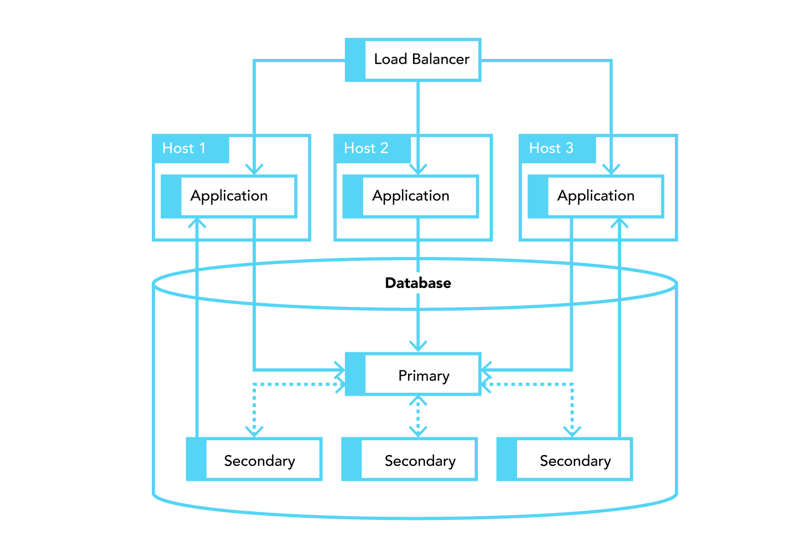
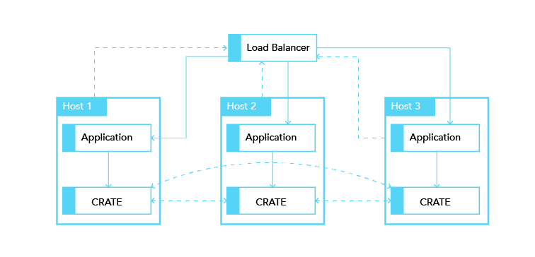

.. _concept-clustering:

==========
Clustering
==========

The aim of this document is to describe, on a high level, how the distributed
SQL database CrateDB uses a shared nothing architecture to form high-
availability, resilient database clusters with minimal effort of configuration.

It will lay out the core concepts of the shared nothing architecture at the
heart of CrateDB. The main difference to a `primary-secondary architecture`_ is
that every node in the CrateDB cluster can perform every operation - hence all
nodes are equal in terms of functionality (see
:ref:`concept-node-components`) and are configured the same.

.. rubric:: Table of contents

.. contents::
   :local:

.. _concept-node-components:

Components of a CrateDB Node
============================

To understand how a CrateDB cluster works it makes sense to first take a look
at the components of an individual node of the cluster.

.. _figure_1:

   Figure 1

   Multiple interconnected instances of CrateDB form a single database cluster.
   The components of each node are equal.

:ref:`figure_1` shows that in CrateDB each node of a cluster contains the same
components that (a) interface with each other, (b) with the same component from
a different node and/or (c) with the outside world. These four major components
are: SQL Handler, Job Execution Service, Cluster State Service, and Data
Storage.

SQL Handler
-----------

The SQL Handler part of a node is responsible for three aspects:

(a) handling incoming client requests,
(b) parsing and analyzing the SQL statement from the request and
(c) creating an execution plan based on the analyzed statement
    (`abstract syntax tree`_)

The SQL Handler is the only of the four components that interfaces with the
"outside world". CrateDB supports three protocols to handle client requests:

(a) HTTP
(b) a Binary Transport Protocol
(c) the PostgreSQL Wire Protocol

A typical request contains a SQL statement and its corresponding arguments.

Job Execution Service
---------------------

The Job Execution Service is responsible for the execution of a plan ("job").
The phases of the job and the resulting operations are already defined in the
execution plan. A job usually consists of multiple operations that are
distributed via the Transport Protocol to the involved nodes, be it the local
node and/or one or multiple remote nodes. Jobs maintain IDs of their individual
operations. This allows CrateDB to "track" (or for example "kill") distributed
queries.

Cluster State Service
---------------------

The three main functions of the Cluster State Service are:

(a) cluster state management,
(b) election of the master node and
(c) node discovery, thus being the main component for cluster building (as
    described in section :ref:`concept-clusters`).

It communicates using the Binary Transport Protocol.

Data storage
------------

The data storage component handles operations to store and retrieve data from
disk based on the execution plan.

In CrateDB, the data stored in the tables is sharded, meaning that tables are
divided and (usually) stored across multiple nodes. Each shard is a separate
Lucene index that is stored physically on the filesystem. Reads and writes are
operating on a shard level.

.. _concept-clusters:

Multi-node setup: Clusters
==========================

A CrateDB cluster is a set of two or more CrateDB instances (referred to as
*nodes*) running on different hosts which form a single, distributed database.

For inter-node communication, CrateDB uses a software specific transport
protocol that utilizes byte-serialized Plain Old Java Objects (`POJOs`_) and
operates on a separate port. That so-called "transport port" must be open and
reachable from all nodes in the cluster.

Cluster state management
------------------------

The cluster state is versioned and all nodes in a cluster keep a copy of the
latest cluster state. However, only a single node in the cluster -- the
*master node* -- is allowed to change the state at runtime.

Settings, metadata, and routing
................................

The cluster state contains all necessary meta information to maintain the
cluster and coordinate operations:

* Global cluster settings
* Discovered nodes and their status
* Schemas of tables
* The status and location of primary and replica shards

When the master node updates the cluster state it will publish the new state to all
nodes in the cluster and wait for all nodes to respond before processing
the next update.

.. _concept-master-election:

Master Node Election
--------------------

In a CrateDB cluster there can only be one master node at any single time.
The cluster only becomes available to serve requests once a master has been 
elected, and a new election takes place if the current master node becomes 
unavailable.

By default, all nodes are master-eligible, but
:ref:`a node setting <node.master>`
is available to indicate, if desired, that a node must not take on the role
of master.

To elect a master among the eligible nodes, a majority
(``floor(half)+1``), also known as *quorum*, is required among a subset of 
all master-eligible nodes, this subset of nodes is known as the
*voting configuration*.
The *voting configuration* is a list which is persisted as part of the cluster
state. It is maintained automatically in a way that makes so that split-brain
scenarios are never possible.

Every time a node joins the cluster, or leaves the cluster, even if it is 
for a few seconds, CrateDB re-evaluates the voting configuration.
If the new number of master-eligible nodes in the cluster is odd, CrateDB will
put them all in the voting configuration.
If the number is even, CrateDB will exclude one of the master-eligible nodes
from the voting configuration.

The voting configuration is not shrunk below 3 nodes, meaning that if there
were 3 nodes in the voting configuration and one of them becomes unavailable,
they all stay in the voting configuration and a quorum of 2 nodes is still 
required.
A master node rescinds its role if it cannot contact a quorum of nodes from
the latest voting configuration.

.. WARNING::

   If you do infrastructure maintenance, please note that as nodes are shutdown 
   or rebooted, they will temporarily leave the voting configuration, and for
   the cluster to elect a master a quorum is required among the
   nodes that were last in the voting configuration.

   For instance, if you
   have a 5-nodes cluster, with all nodes master-eligible, and node 1 is 
   currently the master, and you shutdown node 5, then node 4, then node 3, 
   the cluster will stay available as the voting configuration will have 
   adapted to only have nodes 1, 2, and 3 on it.

   If you then shutdown one more node the cluster will become unavailable as
   a quorum of 2 nodes is now required and not available.
   To bring the cluster back online at this point you will require two nodes 
   among 1, 2, and 3. Bringing back nodes 3, 4, and 5, will not be sufficient.
  
.. NOTE::

   Special `settings and considerations 
   <https://crate.io/docs/crate/reference/en/5.1/concepts/clustering.html#master-node-election>`_
   applied prior to CrateDB version 4.0.0.

.. _concept-discovery:

Discovery
---------

The process of finding, adding and removing nodes is done in the discovery
module.

.. _figure_2:

   Figure 2

   Phases of the node discovery process. n1 and n2 already form a cluster where
   n1 is the elected master node, n3 joins the cluster. The cluster state
   update happens in parallel!

Node discovery happens in multiple steps:

* CrateDB requires a list of potential host addresses for other CrateDB nodes
  when it is starting up. That list can either be provided by a static
  configuration or can be dynamically generated, for example by fetching DNS
  SRV records, querying the Amazon EC2 API, and so on.

* All potential host addresses are pinged. Nodes which receive the request
  respond to it with information about the cluster it belongs to, the current
  master node, and its own node name.

* Now that the node knows the master node, it sends a join request. The
  Primary verifies the incoming request and adds the new node to the cluster
  state that now contains the complete list of all nodes in the cluster.

* The cluster state is then published across the cluster. This guarantees the
  common knowledge of the node addition.

.. CAUTION::

    If a node is started without any :ref:`initial_master_nodes
    <cluster.initial_master_nodes>` or a :ref:`discovery_type <discovery.type>`
    set to ``single-node`` (e.g., the default configuration), it will never join
    a cluster even if the configuration is subsequently changed.

    It is possible to force the node to forget its current cluster state by
    using the :ref:`cli-crate-node` CLI tool. However, be aware that this may
    result in data loss.

Networking
----------

In a CrateDB cluster all nodes have a direct link to all other nodes; this is
known as `full mesh`_ topology. Due to simplicity reasons every node maintains
a one-way connections to every other node in the network. The network topology
of a 5 node cluster looks like this:

.. _figure_3:

   Figure 3

   Network topology of a 5 node CrateDB cluster. Each line represents a one-way
   connection.

The advantages of a fully connected network are that it provides a high degree
of reliability and the paths between nodes are the shortest possible. However,
there are limitations in the size of such networked applications because the
number of connections (c) grows quadratically with the number of nodes (n):

.. code-block:: mathematica

  c = n * (n - 1)

Cluster behavior
================

The fact that each CrateDB node in a cluster is equal allows applications and
users to connect to any node and get the same response for the same operations.
As already described in section :ref:`concept-node-components`, the SQL
handler is responsible for handling incoming client SQL requests, either using
the HTTP transport protocol, or the PostgreSQL wire protocol.

The "handler node" that
accepts the client request also returns the response to the client. It does
neither redirect nor delegate the request to a different nodes. The handler
node parses the incoming request into a syntax tree, analyzes it and creates
an execution plan locally. Then the operations of the plan are executed in a
distributed manner. The upstream of the final phase of the execution is always
the handler which then returns the response to the client.

Application use case
====================

In a conventional setup of an application using a primary-secondary database the
deployed stack looks similar to this:

.. _figure_4:

   Figure 4

   Conventional deployment of an application-database stack.

However, this given setup does not scale because all application servers use
the same, single entry point to the database for writes (the application can
still read from secondaries) and if that entry point is unavailable the complete
stack is broken.

Choosing a shared nothing architecture allows DevOps to deploy their
applications in an "elastic" manner without SPoF. The idea is to extend the
shared nothing architecture from the database to the application which in most
cases is stateless already.

.. _figure_5:

   Figure 5

   Elastic deployment making use of the shared nothing architecture.

If you deploy an instance of CrateDB together with every application server you
will be able to dynamically scale up and down your database backend depending
on your needs. The application only needs to communicate to its "bound" CrateDB
instance on localhost. The load balancer tracks the health of the hosts and if
either the application or the database on a single host fails the complete host
will taken out of the load balancing.

.. _primary-secondary architecture: https://en.wikipedia.org/wiki/Master/slave_(technology)
.. _abstract syntax tree: https://en.wikipedia.org/wiki/Abstract_syntax_tree
.. _POJOs: https://en.wikipedia.org/wiki/Plain_Old_Java_Object
.. _full mesh: https://en.wikipedia.org/wiki/Network_topology#Mesh
.. _split-brain: https://en.wikipedia.org/wiki/Split-brain_(computing)
