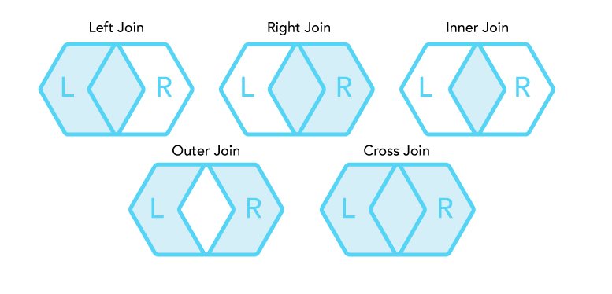
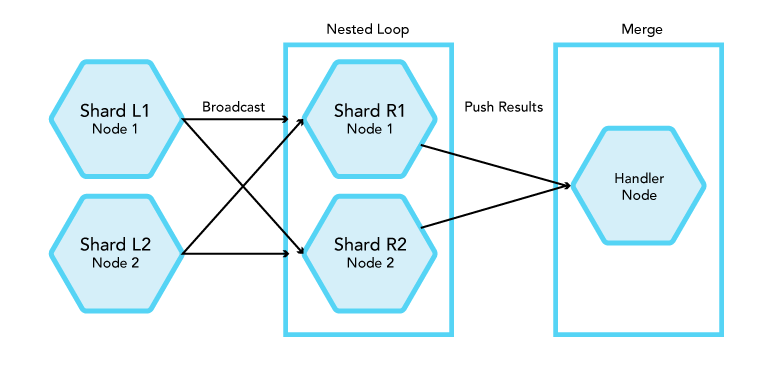
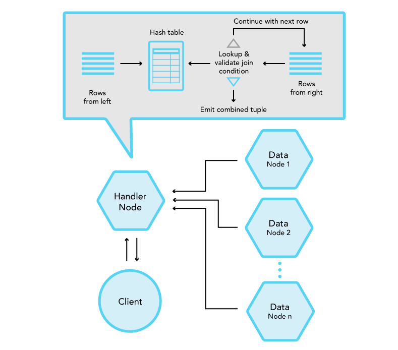
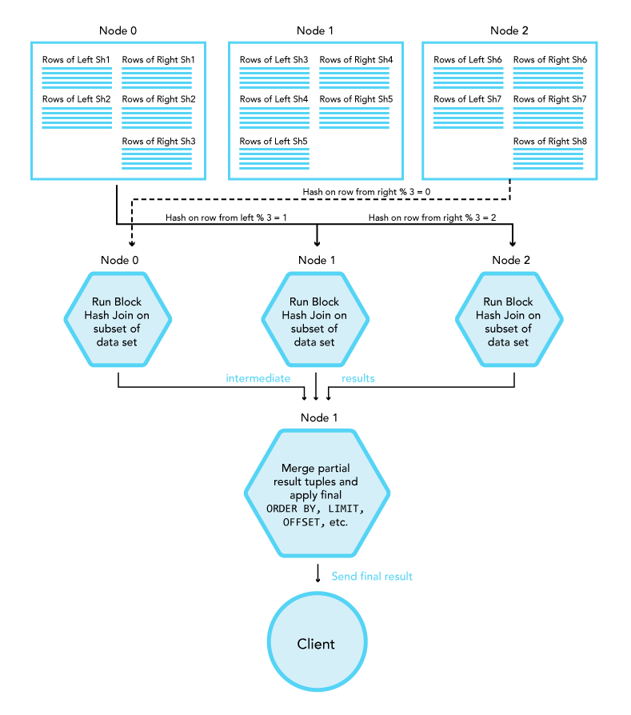
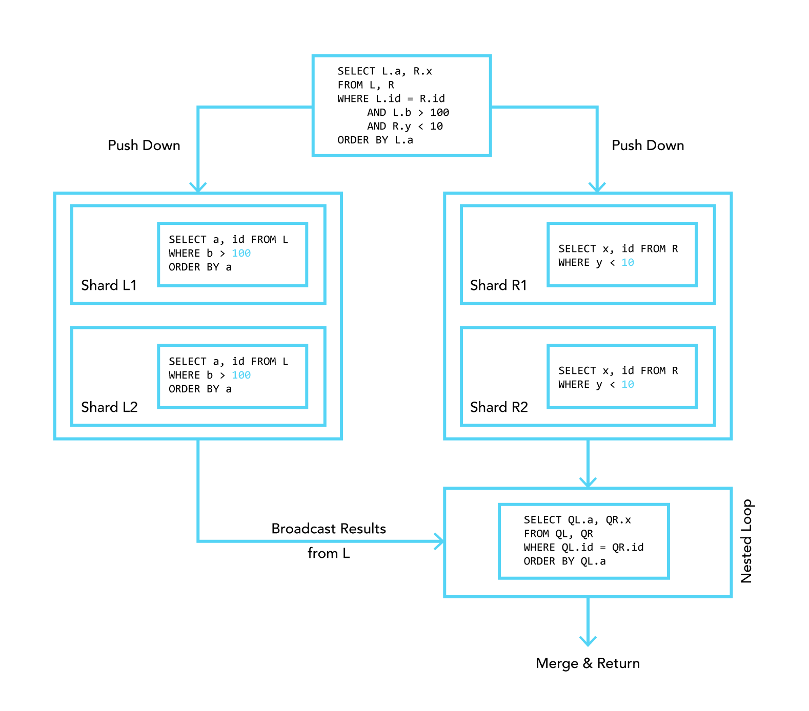

.. _concept-joins:

=====
Joins
=====

:ref:`Joins <sql_joins>` are essential operations in relational databases. They
create a link between rows based on common values and allow the meaningful
combination of these rows. CrateDB supports joins and due to its distributed
nature allows you to work with large amounts of data.

In this document we will present the following topics. First, an overview of
the existing types of joins and algorithms provided. Then a description of how
CrateDB implements them along with the necessary optimizations, which allows us
to work with huge datasets.

.. rubric:: Table of contents

.. contents::
   :local:

.. _join-types:

Join types
==========

A join is a relational operation that merges two data sets based on certain
properties. :ref:`joins_figure_1` (Inspired by `this article`_) shows which
elements appear in which join.

.. _joins_figure_1:

   Join Types

   From left to right, top to bottom: left join, right join, inner join, outer
   join, and cross join of a set L and R.

.. _join-types-cross:

Cross join
----------

A :ref:`cross join <cross-joins>` returns the Cartesian product of two or more
relations. The result of the Cartesian product on the relation *L* and *R*
consists of all possible permutations of each tuple of the relation *L* with
every tuple of the relation *R*.

.. _join-types-inner:

Inner join
----------

An :ref:`inner join <inner-joins>` is a join of two or more relations that
returns only tuples that satisfy the join condition.

.. _join-types-equi:

Equi Join
.........

An *equi join* is a subset of an inner join and a comparison-based join, that
uses equality comparisons in the join condition. The equi join of the relation
*L* and *R* combines tuple *l* of relation *L* with a tuple *r* of the relation
*R* if the join attributes of both tuples are identical.

.. _join-types-outer:

Outer join
----------

An :ref:`outer join <outer-joins>` returns a relation consisting of tuples that
satisfy the join condition and dangling tuples from both or one of the
relations, respectively to the outer join type.

An outer join can be one of the following types:

- **Left** outer join returns tuples of the relation *L* matching tuples of
  the relation *R* and dangling tuples of the relation *R* padded with null
  values.

- **Right** outer join returns tuples of the relation *R* matching tuples of
  the relation *L* and dangling tuples from the relation *L* padded with null
  values.

- **Full** outer join returns matching tuples of both relations and dangling
  tuples produced by left and right outer joins.

.. _join-algos:

Join algorithms
===============

CrateDB supports (a) CROSS JOIN, (b) INNER JOIN, (c) EQUI JOIN, (d) LEFT JOIN,
(e) RIGHT JOIN and (f) FULL JOIN. All of these join types are executed using
the :ref:`nested loop join algorithm <join-algos-nested-loop>` except for the
:ref:`Equi Joins <join-types-equi>` which are executed using the :ref:`hash
join algorithm <join-algos-hash>`. Special optimizations, according to the
specific use cases, are applied to improve execution performance.

.. _join-algos-nested-loop:

Nested loop join
----------------

The **nested loop** join is the simplest join algorithm. One of the relations
is nominated as the inner relation and the other as the outer relation. Each
tuple of the outer relation is compared with each tuple of the inner relation
and if the join condition is satisfied, the tuples of the relation *L* and *R*
are concatenated and added into the returned virtual relation::

    for each tuple l ∈ L do
        for each tuple r ∈ R do
            if l.a Θ r.b
                put tuple(l, r) in Q

*Listing 1. Nested loop join algorithm.*

.. _join-algos-nested-loop-prim:

Primitive nested loop
.....................

For joins on some relations, the nested loop operation can be executed directly
on the handler node. Specifically for queries involving a CROSS JOIN or joins
on `system tables`_ /`information_schema`_ each shard sends the data to the
handler node. Afterwards, this node runs the nested loop, applies limits, etc.
and ultimately returns the results. Similarly, joins can be nested, so instead
of collecting data from shards the rows can be the result of a previous join or
:ref:`table function <table-functions>`.

.. _join-algos-nested-loop-dist:

Distributed nested loop
.......................

Relations are usually distributed to different nodes which require the nested
loop to acquire the data before being able to join. After finding the locations
of the required shards (which is done in the planning stage), the smaller data
set (based on the row count) is broadcast amongst all the nodes holding the
shards they are joined with.

After that, each of the receiving nodes can start
running a nested loop on the subset it has just received. Finally, these
intermediate results are pushed to the original (handler) node to merge and
return the results to the requesting client (see :ref:`joins_figure_2`).

.. _joins_figure_2:

   Nodes that are holding the smaller shards broadcast the data to the
   processing nodes which then return the results to the requesting node.

Queries can be optimized if they contain (a) ORDER BY, (b) LIMIT, or (c) if
INNER/EQUI JOIN. In any of these cases, the nested loop can be terminated
earlier:

- Ordering allows determining whether there are records left

- Limit states the maximum number of rows that are returned

Consequently, the number of rows is significantly reduced allowing the
operation to complete much faster.

.. _join-algos-hash:

Hash join
---------

The Hash Join algorithm is used to execute certain types of joins in a more
efficient way than :ref:`Nested Loop <join-algos-nested-loop>`.

.. _join-algos-hash-basic:

Basic algorithm
...............

The operation takes place in one node (the handler node to which the client is
connected). The rows of the left relation of the join are read and a hashing
algorithm is applied on the fields of the relation which participate in the
join condition. The hashing algorithm generates a hash value which is used to
store every row of the left relation in the proper position in a `hash table`_.

Then the rows of the right relation are read one-by-one and the same hashing
algorithm is applied on the fields that participate in the join condition. The
generated hash value is used to make a lookup in the `hash table`_. If no entry
is found, the row is skipped and the processing continues with the next row
from the right relation. If an entry is found, the join condition is validated
(handling hash collisions) and on successful validation the combined tuple of
left and right relation is returned.

.. _joins_figure_3:

   Basic hash join algorithm

.. _join-algos-hash-block:

Block hash join
...............

The Hash Join algorithm requires a `hash table`_ containing all the rows of the
left relation to be stored in memory. Therefore, depending on the size of the
relation (number of rows) and the size of each row, the size of this hash table
might exceed the available memory of the node executing the hash join. To
resolve this limitation the rows of the left relation are loaded into the hash
table in blocks.

On every iteration the maximum available size of the `hash table`_ is
calculated, based on the number of rows and size of each row of the table but
also taking into account the available memory for query execution on the node.
Once this block-size is calculated the rows of the left relation are processed
and inserted into the `hash table`_ until the block-size is reached.

The operation then starts reading the rows of the right relation, process them
one-by-one and performs the lookup and the join condition validation. Once all
rows from the right relation are processed the `hash table`_ is re-initialized
based on a new calculation of the block size and a new iteration starts until
all rows of the left relation are processed.

With this algorithm the memory limitation is handled in expense of having to
iterate over the rows of the right table multiple times, and it is the default
algorithm used for Hash Join execution by CrateDB.

.. _join-algos-hash-block-switch:

Switch tables optimization
''''''''''''''''''''''''''

Since the right table can be processed multiple times (number of rows from left
/ block-size) the right table should be the smaller (in number of rows) of the
two relations participating in the join. Therefore, if originally the right
relation is larger than the left the query planner performs a switch to take
advantage of this detail and execute the hash join with better performance.

.. _join-algos-hash-dist:

Distributed block hash join
...........................

Since CrateDB is a distributed database and a standard deployment consists of
at least three nodes and in most case of much more, the Hash Join algorithm
execution can be further optimized (performance-wise) by executing it in a
distributed manner across the CrateDB cluster.

The idea is to have the hash join operation executing in multiple nodes of the
cluster in parallel and then merge the intermediate results before returning
them to the client.

A hashing algorithm is applied on every row of both the left and right
relations. On the integer value generated by this hash, a modulo, by the number
of nodes in the cluster, is applied and the resulting number defines the node
to which this row should be sent. As a result each node of the cluster receives
a subset of the whole data set which is ensured (by the hashing and modulo) to
contain all candidate matching rows.

Each node in turn performs a :ref:`block hash join <join-algos-hash-block>` on
this subset and sends its result tuples
to the handler node (where the client issued the query). Finally, the handler
node receives those intermediate results, merges them and applies any pending
``ORDER BY``, ``LIMIT`` and ``OFFSET`` and sends the final result to the
client.

This algorithm is used by CrateDB for most cases of hash join execution except
for joins on complex subqueries that contain ``LIMIT`` and/or ``OFFSET``.

.. _joins_figure_4:

   Distributed hash join algorithm

.. _join-optim:

Join optimizations
==================

.. _join-optim-optim-query-fetch:

Query then fetch
----------------

Join operations on large relation can be extremely slow especially if the join
is executed with a :ref:`Nested Loop <join-algos-nested-loop>`. - which means that
the runtime complexity grows quadratically (O(n*m)). Specifically for
:ref:`cross joins <cross-joins>` this results in large amounts of data sent
over the network and loaded into memory at the handler node. CrateDB reduces
the volume of data transferred by employing "Query Then Fetch": First, filtering
and ordering are applied (if possible where the data is located) to obtain the
required document IDs. Next, as soon as the final data set is ready, CrateDB
fetches the selected fields and returns the data to the client.

.. _join-optim-optim-push-down:

Push-down query optimization
----------------------------

Complex queries such as Listing 2 require the planner to decide when to filter,
sort, and merge in order to efficiently execute the plan. In this case, the
query would be split internally into subqueries before running the join. As
shown in :ref:`joins_figure_5`, first filtering (and ordering) is applied to
relations *L* and *R* on their shards, then the result is directly broadcast to
the nodes running the join. Not only will this behavior reduce the number of
rows to work with, it also distributes the workload among the nodes so that the
(expensive) join operation can run faster.

.. code-block:: SQL

    SELECT L.a, R.x
    FROM L, R
    WHERE L.id = R.id
      AND L.b > 100
      AND R.y < 10
    ORDER BY L.a

*Listing 2. An INNER JOIN on ids (effectively an EQUI JOIN) which can be
optimized.*

.. _joins_figure_5:

   Figure 5

   Complex queries are broken down into subqueries that are run on their shards
   before joining.

.. _join-optim-cross-join-elimination:

Cross join elimination
----------------------

The optimizer will try to eliminate cross joins in the query plan by changing
the join-order. Cross join elimination replaces a CROSS JOIN with an INNER JOIN
if query conditions used in the WHERE clause or other join conditions allow
for it. An example:

.. code-block:: SQL

    SELECT *
    FROM t1 CROSS JOIN t2
    INNER JOIN t3
    ON t3.z = t1.x AND t3.z = t2.y

The cross join elimination will change the order of the query from t1, t2, t3
to t2, t1, t3 so that each join has a join condition and the CROSS JOIN can be
replaced by an INNER JOIN. When reordering, it will try to preserve the
original join order as much as possible. If a CROSS JOIN cannot be eliminated,
the original join order will be maintained. This optimizer rule can be disabled
with the :ref:`optimizer eliminate cross join session setting
<conf-session-optimizer_eliminate_cross_join>`::

    SET optimizer_eliminate_cross_join = false

Note that this setting is experimental, and may change in the future.

.. _hash table: https://en.wikipedia.org/wiki/Hash_table
.. _here: http://www.dcs.ed.ac.uk/home/tz/phd/thesis.pdf
.. _information_schema: https://crate.io/docs/reference/sql/information_schema.html
.. _system tables: https://crate.io/docs/reference/sql/system.html
.. _this article: https://www.codeproject.com/Articles/33052/Visual-Representation-of-SQL-Joins
