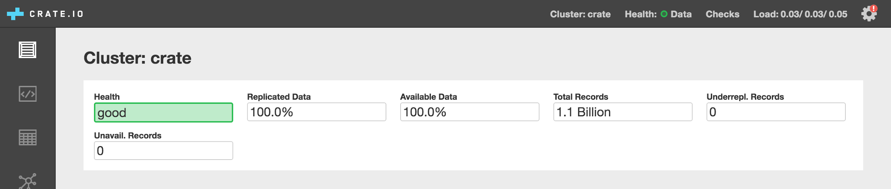

.. _concept-resiliency:

==========
Resiliency
==========

Distributed systems are tricky. All sorts of things can go wrong that are
beyond your control. The network can go away, disks can fail, hosts can be
terminated unexpectedly. CrateDB tries very hard to cope with these sorts of
issues while maintaining :ref:`availability <concept-clustering>`,
:ref:`consistency <concept-consistency>`, and :ref:`durability
<concept-durability>`.

However, as with any distributed system, sometimes, *rarely*, things can go
wrong.

Thankfully, for most use-cases, if you follow best practices, you are extremely
unlikely to experience resiliency issues with CrateDB.

.. SEEALSO::

    :ref:`Appendix: Resiliency Issues <appendix-resiliency>`

.. rubric:: Table of contents

.. contents::
   :local:

.. _concept-resiliency-monitoring:

Monitoring cluster status
=========================

The Admin UI in CrateDB has a status indicator which can be used to determine
the stability and health of a cluster.

A green status indicates that all shards have been replicated, are available,
and are not being relocated. This is the lowest risk status for a cluster. The
status will turn yellow when there is an elevated risk of encountering issues,
due to a network failure or the failure of a node in the cluster.

The status is updated every few seconds (variable on your cluster `ping
configuration
<https://www.elastic.co/docs/reference/elasticsearch/configuration-reference/discovery-cluster-formation-settings>`_).

.. _concept-resiliency-consistency:

Storage and consistency
=======================

Code that expects the behavior of an `ACID
<https://en.wikipedia.org/wiki/ACID>`_ compliant database like MySQL may not
always work as expected with CrateDB.

CrateDB does not support ACID transactions, but instead has :ref:`atomic
operations <concept-atomicity>` and :ref:`eventual consistency
<concept-consistency>` at the row level. See also :ref:`concept-clustering`.

Eventual consistency is the trade-off that CrateDB makes in exchange for
high-availability that can tolerate most hardware and network failures. So you
may observe data from different cluster nodes temporarily falling very briefly
out-of-sync with each other, although over time they will become consistent.

For example, you know a row has been written as soon as you get the ``INSERT
OK`` message. But that row might not be read back by a subsequent ``SELECT`` on
a different node until after a :ref:`table refresh <sql-refresh>` (which
typically occurs within one second).

Your applications should be designed to work this storage and consistency model.

.. _concept-resiliency-deployment:

Deployment strategies
=====================

When deploying CrateDB you should carefully weigh your need for
high-availability and disaster recovery against operational complexity and
expense.

Which strategy you pick is going to depend on the specifics of your situation.

Here are some considerations:

-  CrateDB is designed to scale horizontally. Make sure that your machines are
   fit for purpose, i.e. use SSDs, increase RAM up to 64 GB, and use multiple
   CPU cores when you can. But if you want to dynamically increase (or
   decrease) the capacity of your cluster, `add (or remove) nodes
   <https://crate.io/docs/crate/howtos/en/latest/clustering/multi-node-setup.html>`_.

-  If availability is a concern, you can add `nodes across multiple zones
   <https://crate.io/docs/crate/howtos/en/latest/clustering/multi-zone-setup.html>`_
   (e.g. different data centers or geographical regions). The more available
   your CrateDB cluster is, the more likely it is to withstand external
   failures like a zone going down.

-  If data durability or read performance is a concern, you can increase the
   number of :ref:`table replicas <concept-data-storage>`.
   More table replicas means a smaller chance of permanent data loss due to
   hardware failures, in exchange for the use of more disk space and more
   intra-cluster network traffic.

-  If disaster recovery is important, you can :ref:`take regular snapshots
   <snapshot-restore>` and store those snapshots in cold storage. This
   safeguards data that has already been successfully written and replicated
   across the cluster.

-  CrateDB works well as part of a `data pipeline
   <https://crate.io/docs/tools/streamsets/>`_, especially if you’re working
   with high-volume data. If you have a message queue in front of CrateDB, you
   can configure it with backups and replay the data flow for a specific
   timeframe. This can be used to recover from issues that affect your data
   before it has been successfully written and replicated across the cluster.

   Indeed, this is the generally recommended way to recover from any of the
   rare consistency or data-loss issues you might encounter when CrateDB
   experiences network or hardware failures (see next section).
